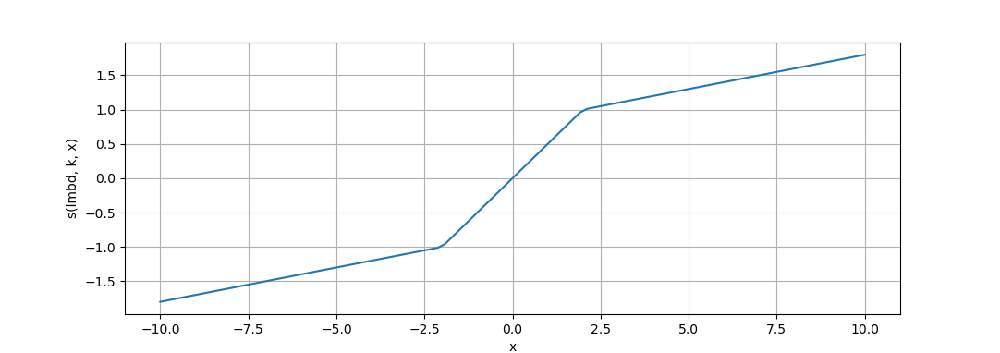
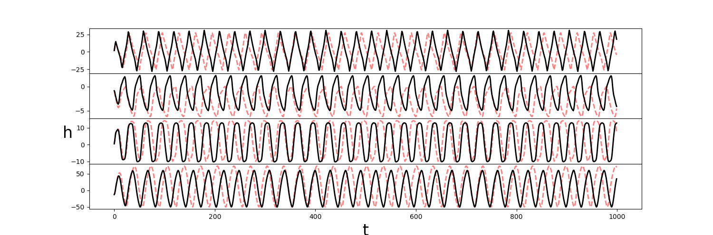
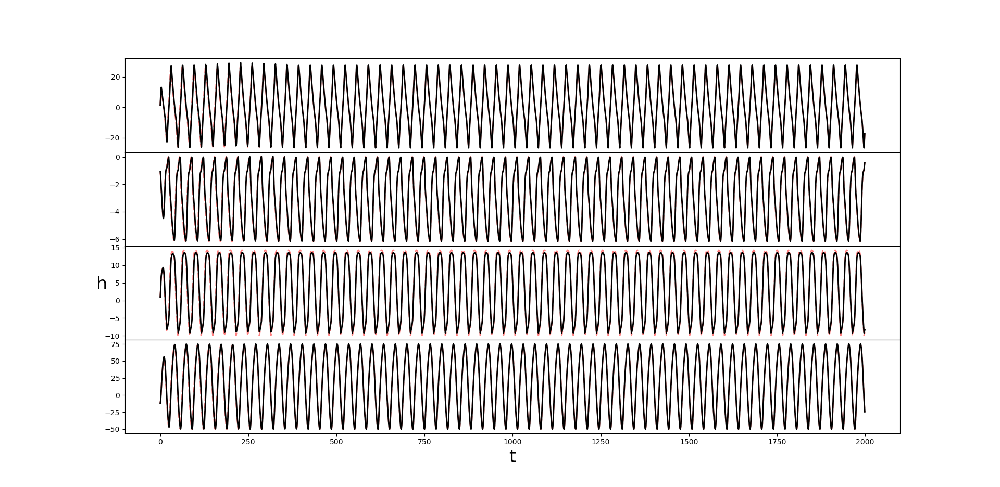
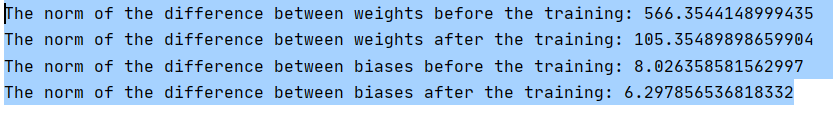
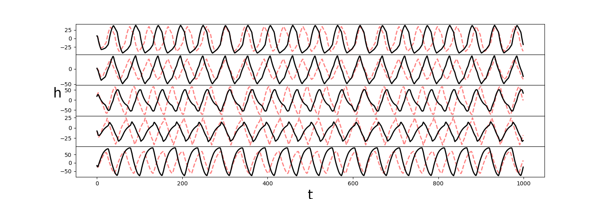
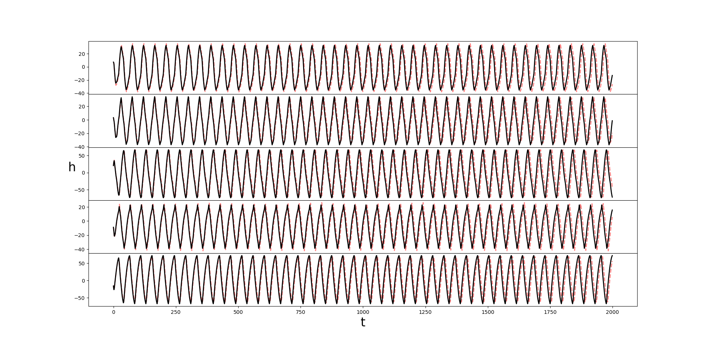
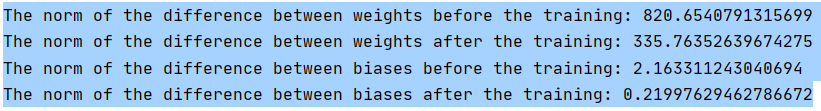
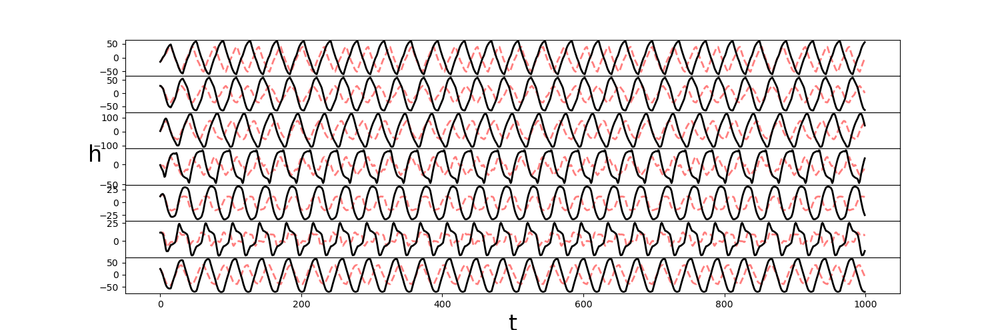
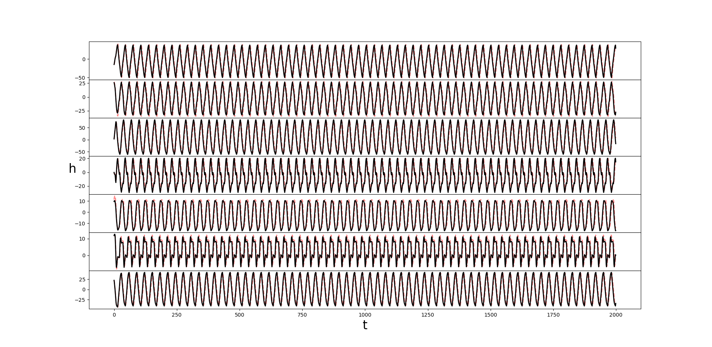
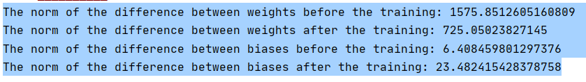

**The RTLR learning on a simple recurrent network 
with a piecewise linear activation function**

sigma(x) function:

if x <= -1/lambda:  sigma(x) =  kx - (1 - k / lambda)

if x in (-1/lambda, 1/ lambda): sigma(x) = lambda x
 
if x >= 1/lambda : sigma(x) =  kx + (1 - k / lambda)

**Examples**

Before

After

Stats

Before

After

Stats

Before

After

Stats

**Comments**

The learning is really slow and can only learn if
the system is already in the ballpark of the optimal parameters.

  
      
      
      
      